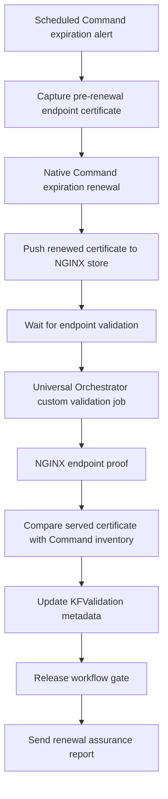

# NGINX Certificate Renewal Assurance

This use case demonstrates a custom, application-centric TLS certificate renewal assurance process using Keyfactor Command, Keyfactor Universal Orchestrator, and an NGINX web server.

The objective is not merely to renew a certificate. The workflow provides evidence that the renewed certificate was deployed to the target application and the certificate is actually being served over TLS.

> **Reference implementation:** This is an art-of-the-possible implementation. It is not a single out-of-the-box Keyfactor feature. It combines native Keyfactor capabilities with custom scripts, a custom Universal Orchestrator job extension, a Command-side job-completion handler, and target-side NGINX validation scripts.

## Workflow



At a high level, the workflow:

1. Uses a scheduled Keyfactor Command expiration alert to start a workflow for a specific NGINX certificate.
2. Captures the certificate currently being served by the NGINX application endpoint before renewal.
3. Renews the certificate using Command's native expiration-renewal workflow step.
4. Pushes the renewed certificate to the NGINX certificate store.
5. Runs endpoint validation from Universal Orchestrator.
6. Confirms that NGINX is serving the renewed certificate.
7. Updates Keyfactor Command metadata with validation evidence.
8. Sends an assurance email proving the certificate was renewed, deployed, and validated.

## Repository structure

```text
command/       Keyfactor Command workflow exports, workflow scripts, handler source/config and profile config
orchestrator/  Universal Orchestrator custom job source, validation scripts and profile config
nginx/         NGINX deployment/proof scripts, minimal vhost example and privilege templates
docs/          Architecture, rebuild guidance and workflow-step reference
evidence/      Synthetic example validation evidence
```

## Native and custom components

**Native Keyfactor capabilities used:** expiration alerts, workflows, certificate renewal, certificate-store deployment, metadata, REST APIs, Universal Orchestrator, and custom jobs.

**Custom implementation elements:** pre-renewal endpoint capture, profile-driven validation scripts, the `Custom.EndpointValidation` Universal Orchestrator extension, the Command-side `EndpointValidationReleaseHandler`, NGINX deployment/proof scripts, and application-centric evidence enrichment.

## Command-side completion handler

The Command-side `EndpointValidationReleaseHandler` source project is included under `command/job-complete-handler/source/EndpointValidationReleaseHandler/`. Compiled DLL/PDB artifacts remain intentionally excluded. The public source uses synthetic fallback job-type GUIDs; configure the real IDs in the handler manifest for the target Command environment before building/deploying.

## Configuration

All public examples use reserved example values such as:

- `command.example.com`
- `nginx01.example.com`
- `ca.example.com`
- `app-owner@example.com`

GUIDs in exported examples are synthetic but structurally valid. Do not reuse them in a real Command environment; use the IDs created by your own deployment.

## Security

Do not commit Command credentials, SSH private keys, TLS private keys, PFX/P12 files, runtime evidence caches, environment inventory exports, or debug symbols. See [SECURITY.md](SECURITY.md).

## Rebuild sequence

1. Prepare the NGINX target and controlled deployment/proof commands.
2. Install and configure the Universal Orchestrator validation scripts and custom job extension.
3. Configure Command-side workflow scripts and the job-completion handler.
4. Create the `KFValidation_*` metadata fields.
5. Create/configure the NGINX certificate store.
6. Create the application validation profile.
7. Create the `EndpointValidation` custom job type.
8. Create the certificate collection and scheduled expiration alert.
9. Import/recreate the workflow.
10. Run a full renewal and verify endpoint, inventory, metadata, and email evidence.

See [docs/architecture-and-rebuild-guide.md](docs/architecture-and-rebuild-guide.md) for implementation detail.
